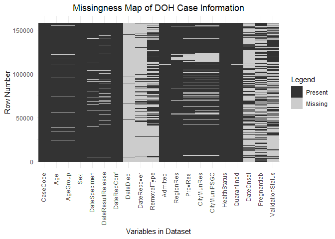
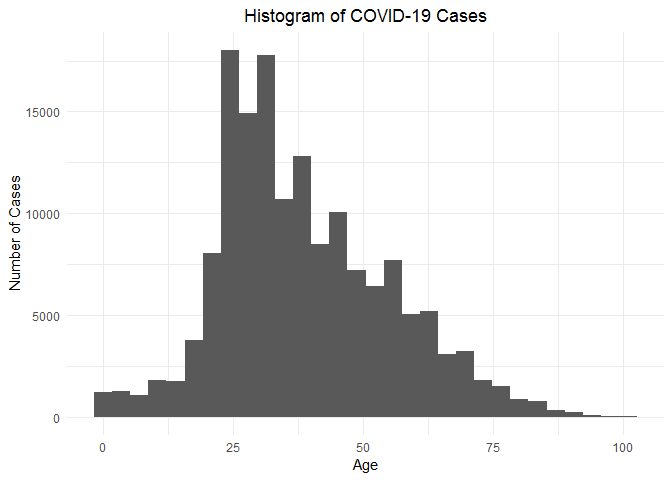
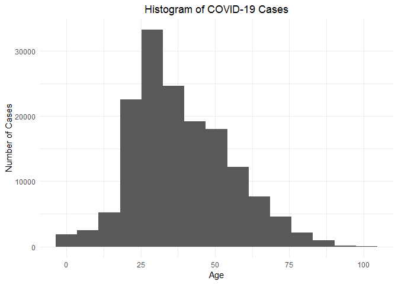
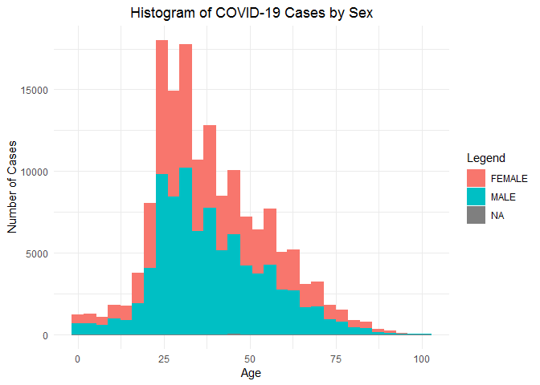
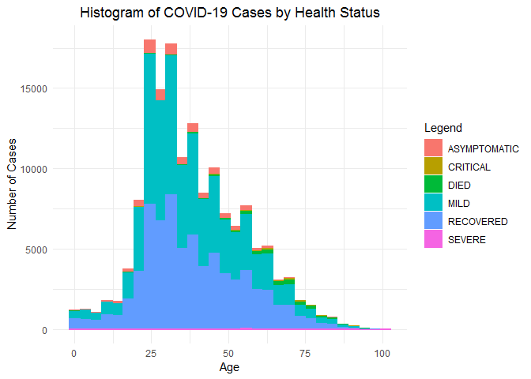
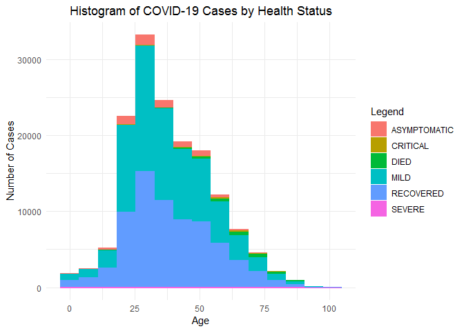
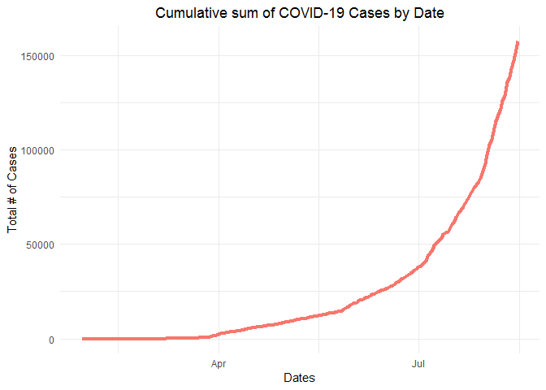
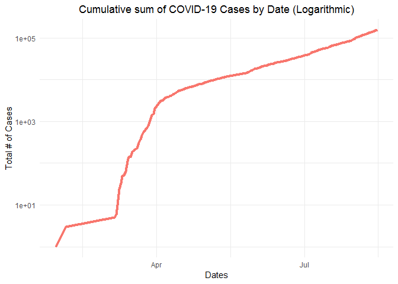

Background
----------

The Severe Acute Respiratory Syndrome Coronavirus 2 or COVID-19 had a
significant impact to nations across the world. Governments impose
health protocols to control the spread of the disease and prevent
further problems.

In the Philippines, the Department of Health (DOH) releases updates on
COVID-19 cases through several mediums like websites, social media
pages, and news.

DOH released raw data containing information regarding COVID-19 through
Data Drop by Google Drive. Every few days, the institution released
updated cases though separate files in `.csv` formats. As of the time of
this publication, the latest case information was dated last **July
28,2020**.

Scope of the Report
-------------------

The information retrieved by this project would be the cases that are
updated last **July 18, 2020**. Therefore, the observations presented
are limited to the cases beyond the aforementioned date.

The functions and scripts used in this report are found in this
[repository](https://github.com/KaidenFrizu/COVID-Analysis). All
variable descriptions, function details, and other technical information
are found in `CODEBOOK.md` found in the same repository.

In addition, the following report would only cover the necessary codes
and descriptive analysis of the data provided and presents observations
within it.

Data Extraction
---------------

The data obtained and used for this report came from [DOH Data
Drop](https://drive.google.com/drive/folders/1UelgRGmUGNMKH1Q3nzqTj57V41bjmnxg?usp=sharing)
though Google Drive. The latest information of the cases as of this date
is found in `DOH COVID Data Drop_2000720 - 04 Case Information.csv` that
can be found using the link above.

In order to find the appropriate code, go to the Data Drop, right-click
the necessary csv file, then click “Get shareable link”. The format of
the given link would be:

`https://drive.google.com/file/d/#########################/view?usp=sharing`

whereas the string of `#`s corresponds to the code required. copy that
code and paste it to the function. In this case, the code would be
`1bM5XvMdRMKzuOsYqwOLzxbsAlLsaMNOI`.

Before performing the following codes, make sure your current working
directory is set to the COVID-Analysis folder (or any folder name as
long as the working directory contains the R files).

In order to obtain the necessary information, the following code below
were executed. *Note: The following variable “Dataframe” is arbitrary
and it can be any variable you desire.*

    ### This section is optional remove #s to execute
    ### It is used to create a fresh R interface

    # if (!is.null(dev.list())) dev.off()
    # cat("\014")
    # rm(list=ls())

    #################################################

    source("datafunctions.R")

    ## Running "datafunctions.R"

    ## Running "filecontrol.R"

    Dataframe <- DataExtract(code = "1bM5XvMdRMKzuOsYqwOLzxbsAlLsaMNOI",
                             filename = "COVID-Data.csv",
                             overwrite = TRUE,
                             na.assign = TRUE)

    ## Download Date: 2020-07-31 17:16:56

    ## File extracted successfully.

    head(Dataframe)

    ##   CaseCode Age AgeGroup    Sex DateSpecimen DateResultRelease DateRepConf
    ## 1  C530688  74 70 to 74   MALE   2020-07-15        2020-07-17  2020-07-19
    ## 2  C392225  68 65 to 69   MALE   2020-06-09        2020-06-10  2020-06-13
    ## 3  C486573   4   0 to 4   MALE   2020-06-28        2020-06-30  2020-07-03
    ## 4  C953564  42 40 to 44   MALE   2020-07-06        2020-07-08  2020-07-11
    ## 5  C958511  59 55 to 59 FEMALE   2020-07-13        2020-07-16  2020-07-19
    ## 6  C905098  41 40 to 44   MALE   2020-06-30        2020-07-02  2020-07-05
    ##   DateDied DateRecover RemovalType Admitted RegionRes ProvRes CityMunRes
    ## 1     <NA>        <NA>        <NA>      YES       NCR    <NA>       <NA>
    ## 2     <NA>        <NA>        <NA>      YES       NCR    <NA>       <NA>
    ## 3     <NA>        <NA>        <NA>       NO       NCR    <NA>       <NA>
    ## 4     <NA>        <NA>        <NA>       NO       NCR    <NA>       <NA>
    ## 5     <NA>        <NA>        <NA>      YES       NCR     NCR       <NA>
    ## 6     <NA>        <NA>        <NA>       NO       NCR    <NA>       <NA>
    ##   CityMuniPSGC HealthStatus Quarantined  DateOnset Pregnanttab ValidationStatus
    ## 1         <NA>       SEVERE          NO 2020-07-07        <NA>             <NA>
    ## 2         <NA>       SEVERE          NO 2020-06-04        <NA>             <NA>
    ## 3         <NA>     CRITICAL          NO       <NA>        <NA>             <NA>
    ## 4         <NA>       SEVERE          NO       <NA>        <NA>             <NA>
    ## 5         <NA>       SEVERE          NO 2020-07-08          NO             <NA>
    ## 6         <NA>     CRITICAL          NO       <NA>        <NA>             <NA>

    names(Dataframe)

    ##  [1] "CaseCode"          "Age"               "AgeGroup"         
    ##  [4] "Sex"               "DateSpecimen"      "DateResultRelease"
    ##  [7] "DateRepConf"       "DateDied"          "DateRecover"      
    ## [10] "RemovalType"       "Admitted"          "RegionRes"        
    ## [13] "ProvRes"           "CityMunRes"        "CityMuniPSGC"     
    ## [16] "HealthStatus"      "Quarantined"       "DateOnset"        
    ## [19] "Pregnanttab"       "ValidationStatus"

The following variables were also created in the process: `urllink` and
`DownloadDate`. This can be used for further reference and
documentation.

    print(urllink)

    ## [1] "https://drive.google.com/uc?export=download&id=1bM5XvMdRMKzuOsYqwOLzxbsAlLsaMNOI"

    print(DownloadDate)

    ## [1] "2020-07-31 17:16:56 CST"

Table Summaries
---------------

In this section, table summaries were created from `Dataframe` and
outputs descriptive information. All codes in this section require
`dplyr` and `tidyr` installed in your system. This can be installed
through `install.packages()`.

    require(dplyr)

    ## Loading required package: dplyr

    ## 
    ## Attaching package: 'dplyr'

    ## The following objects are masked from 'package:stats':
    ## 
    ##     filter, lag

    ## The following objects are masked from 'package:base':
    ## 
    ##     intersect, setdiff, setequal, union

    require(tidyr)

    ## Loading required package: tidyr

### Summary by Health Status

The table below outputs the summary of cases sorted by `HealthStatus`.

    status.summary <- Dataframe %>% group_by(HealthStatus) %>% summarise(n())
    print(status.summary)

    ## # A tibble: 6 x 2
    ##   HealthStatus `n()`
    ##   <fct>        <int>
    ## 1 ASYMPTOMATIC  4890
    ## 2 CRITICAL       226
    ## 3 DIED          1947
    ## 4 MILD         49723
    ## 5 RECOVERED    26617
    ## 6 SEVERE         270

From the data, most of the cases have a health status of `MILD` where
small coughs and sickness were the observed symptoms through most of the
patients. This contributes to the 59.43% of the total cases.

### Summary by Sex

The following lines consider the column `Sex` from `Dataframe`. The
table below outputs the summary of cases sorted by `Sex`.

    sex.summary <- Dataframe %>% group_by(Sex) %>% summarise(n())
    print(sex.summary)

    ## # A tibble: 2 x 2
    ##   Sex    `n()`
    ##   <fct>  <int>
    ## 1 FEMALE 36618
    ## 2 MALE   47055

Based from the table above, there are more male individuals infected
with COVID-19 than female individuals. Male cases are 28.5% higher than
female cases.

The following table below presents the number of cases grouped by both
`Sex` and `HealthStatus`.

    group.summary <- Dataframe %>% group_by(Sex, HealthStatus) %>% summarise(n())
    print(group.summary)

    ## # A tibble: 12 x 3
    ## # Groups:   Sex [2]
    ##    Sex    HealthStatus `n()`
    ##    <fct>  <fct>        <int>
    ##  1 FEMALE ASYMPTOMATIC  2255
    ##  2 FEMALE CRITICAL        92
    ##  3 FEMALE DIED           741
    ##  4 FEMALE MILD         21302
    ##  5 FEMALE RECOVERED    12116
    ##  6 FEMALE SEVERE         112
    ##  7 MALE   ASYMPTOMATIC  2635
    ##  8 MALE   CRITICAL       134
    ##  9 MALE   DIED          1206
    ## 10 MALE   MILD         28421
    ## 11 MALE   RECOVERED    14501
    ## 12 MALE   SEVERE         158

Within all factors of `HealthStatus`, there are more male reported male
cases than female cases.

### Summary by Age

Within the next lines, the following summaries would revolve around
`Age` and `AgeGroup`. This would also show the summary of the following
columns along with `HealthStatus`.

    agegroup.summary <- Dataframe %>% group_by(AgeGroup) %>% summarise(n())

    ## Warning: Factor `AgeGroup` contains implicit NA, consider using
    ## `forcats::fct_explicit_na`

    print(agegroup.summary)

    ## # A tibble: 18 x 2
    ##    AgeGroup `n()`
    ##    <fct>    <int>
    ##  1 0 to 4    1086
    ##  2 10 to 14  1326
    ##  3 15 to 19  2323
    ##  4 20 to 24  8315
    ##  5 25 to 29 12122
    ##  6 30 to 34 11247
    ##  7 35 to 39  8636
    ##  8 40 to 44  7397
    ##  9 45 to 49  6570
    ## 10 5 to 9     944
    ## 11 50 to 54  5917
    ## 12 55 to 59  4980
    ## 13 60 to 64  3837
    ## 14 65 to 69  2823
    ## 15 70 to 74  1989
    ## 16 75 to 79  1088
    ## 17 80+       1174
    ## 18 <NA>      1899

Since there is `NA` values over the column `AgeGroup`, the following
code removes rows containing `NA` values in `AgeGroup`.

    agegroup.summary.na <- Dataframe %>% drop_na(AgeGroup) %>% group_by(AgeGroup) %>% summarise(n())
    print(agegroup.summary.na)

    ## # A tibble: 17 x 2
    ##    AgeGroup `n()`
    ##    <fct>    <int>
    ##  1 0 to 4    1086
    ##  2 10 to 14  1326
    ##  3 15 to 19  2323
    ##  4 20 to 24  8315
    ##  5 25 to 29 12122
    ##  6 30 to 34 11247
    ##  7 35 to 39  8636
    ##  8 40 to 44  7397
    ##  9 45 to 49  6570
    ## 10 5 to 9     944
    ## 11 50 to 54  5917
    ## 12 55 to 59  4980
    ## 13 60 to 64  3837
    ## 14 65 to 69  2823
    ## 15 70 to 74  1989
    ## 16 75 to 79  1088
    ## 17 80+       1174

The age groups with the most number of COVID-19 cases are `25 to 29` and
`30 to 34` where the cases reach over 7000. On the other hand, children
who are 14 years old and below had relatively small numbers of COVID-19
cases compared to other age groups. These numbers are effects of imposed
community curfews to children and the restrictions of community
transmissions.

It is also observed that there are COVID-19 cases among the elderly
people specifically ages 75 and above.

Plots and Graphs
----------------

In this section, graphs and plots were created from `Dataframe` and
outputs descriptive information. All codes in this section require
`ggplot2` installed in your system. This can be installed through
`install.packages()`.

    require(ggplot2)

    ## Loading required package: ggplot2

    require(cowplot)

    ## Loading required package: cowplot

    ## 
    ## ********************************************************

    ## Note: As of version 1.0.0, cowplot does not change the

    ##   default ggplot2 theme anymore. To recover the previous

    ##   behavior, execute:
    ##   theme_set(theme_cowplot())

    ## ********************************************************

### Missingness Map

The following plot below is the visual overview of the data in
`Dataframe`. This plot highlights columns with several `NA`s and columns
with complete data.

    source("plotfunctions.R")

    ## Running "datafunctions.R"

    ## Loading required package: reshape2

    ## Warning: package 'reshape2' was built under R version 3.6.3

    ## 
    ## Attaching package: 'reshape2'

    ## The following object is masked from 'package:tidyr':
    ## 
    ##     smiths

    ## Running "filecontrol.R"

    # The graph below might be blurry at times or doesn't appear at all,    #
    # but you can find the clear graph version in the project folder under  #
    # "plots/Missingness Map.png" as an automatic output to the code below. #

    print(ggplot_missmap(Dataframe, title = "Missingness Map of DOH Case Information",
                         savefile = "Misingness Map.png"))

    ## Loading Missingmap (ggplot)

    ## Saving 7 x 5 in image

As observed from the plot, columns `CaseCode`, `Sex`, `DateRepConf`, and
`HealthStatus` have complete data. Columns `Age` and `AgeGroup` have a
small number of missing cases, while the rest of the columns have large
number of missing data. Some factors to consider are: Undeclared age,
misdeclaration of personal info, etc.

### Histograms

Since there are only limited number of columns that have complete data
(or at least small number of missing data), the report would be focusing
on those said columns.

    case.plot <- ggplot_histogram(Dataframe,
                    xaxis = Dataframe$Age,
                    xlabel = "Age",
                    binnum = 30,
                    ylabel = "Number of Cases")

    ## Loading Histogram

    case.plot + labs(title = "Histogram of COVID-19 Cases")

    ## Warning: Removed 1899 rows containing non-finite values (stat_bin).

From the given histogram, there seems to be numerous cases where
patients are around 25-30 years old. To give a different view of the
distribution, the following code outputs the same histogram but
`binnum = 15`. This would result to fewer bins displayed in the
distribution.

    case.plot2 <- ggplot_histogram(Dataframe,
                    xaxis = Dataframe$Age,
                    xlabel = "Age",
                    binnum = 15,
                    ylabel = "Number of Cases")

    ## Loading Histogram

    case.plot2 + labs(title = "Histogram of COVID-19 Cases")

    ## Warning: Removed 1899 rows containing non-finite values (stat_bin).

The bin tends to draw the most on ranges 25-35. As shown in the table in
the previous section, the age group with most number of COVID-19 cases
are in the range of `25 to 34`. This graph supports the previous
observations in the table where the most number of COVID-19 cases falls
under ages 25 to 34.

On the other hand, the following graph below shows the age histogram of
COVID-19 cases separated by `Sex` where the position of the bins is
stack to one another.

    sex.plot <- ggplot_histogram(Dataframe,
                    xaxis = Dataframe$Age,
                    Legend = Dataframe$Sex,
                    pos = "stack",
                    xlabel = "Age",
                    ylabel = "Number of Cases")

    ## Loading Histogram

    sex.plot + labs(title = "Histogram of COVID-19 Cases by Sex")

    ## Warning: Removed 1899 rows containing non-finite values (stat_bin).

To further visualize the distribution, we could actually compare these
histograms to one another. Before comparing the histograms, this code
illustrates the same distribution as above but `binnum = 15`.

    sex.plot2 <- ggplot_histogram(Dataframe,
                    xaxis = Dataframe$Age,
                    Legend = Dataframe$Sex,
                    pos = "stack",
                    binnum = 15,
                    xlabel = "Age",
                    ylabel = "Number of Cases")

    ## Loading Histogram

    sex.plot2 + labs(title = "Histogram of COVID-19 Cases by Sex")

    ## Warning: Removed 1899 rows containing non-finite values (stat_bin).

To compare the graphs, the following code combines the previous plots.
Notice the similarities of the bins and how the distribution by `Sex`
was formed.

    sex.plotb <- sex.plot + theme(legend.position = "none")
    sex.plot2b <- sex.plot2 + theme(legend.position = "none")

    plot_grid(case.plot, sex.plotb, case.plot2, sex.plot2b,
              labels = c("binnum = 30", "Sex, binnum = 30", "binnum = 15", "Sex, binnum = 15"))

    ## Warning: Removed 1899 rows containing non-finite values (stat_bin).

    ## Warning: Removed 1899 rows containing non-finite values (stat_bin).

    ## Warning: Removed 1899 rows containing non-finite values (stat_bin).

    ## Warning: Removed 1899 rows containing non-finite values (stat_bin).

In this set of graphs, the distribution of COVID-19 cases are
highlighted by `Sex` and is similar to the simple case distribution on
the left side. As mentioned in the previous chapter, there is an
observation of more male cases than female cases.

To consider the `HealthStatus` of each case, the following code shows
the histogram that are separated by `HealthStatus` to be followed by
same histogram with `binnum=15`.

    hs.plot <- ggplot_histogram(Dataframe,
                    xaxis = Dataframe$Age,
                    Legend = Dataframe$HealthStatus,
                    pos = "stack",
                    xlabel = "Age",
                    ylabel = "Number of Cases")

    ## Loading Histogram

    hs.plot + labs(title = "Histogram of COVID-19 Cases by Health Status")

    ## Warning: Removed 1899 rows containing non-finite values (stat_bin).

    hs.plot2 <- ggplot_histogram(Dataframe,
                    xaxis = Dataframe$Age,
                    Legend = Dataframe$HealthStatus,
                    pos = "stack",
                    binnum = 15,
                    xlabel = "Age",
                    ylabel = "Number of Cases")

    ## Loading Histogram

    hs.plot2 + labs(title = "Histogram of COVID-19 Cases by Health Status")

    ## Warning: Removed 1899 rows containing non-finite values (stat_bin).

As previously mentioned, most of the COVID-19 cases have a health status
of `MILD`.

### Line Graphs

By visualizing the trendline of COVID-19 Cases, the data must be grouped
according to dates given followed by the number of cases within each
date using the code below:

    Casecount <- Dataframe %>% count(Dataframe$DateRepConf)
    Casecount$csum <- cumsum(Casecount$n)
    names(Casecount) <- c("Date", "Number.of.Cases", "Cumulative.Sum")

    print(Casecount)

    ## # A tibble: 148 x 3
    ##    Date       Number.of.Cases Cumulative.Sum
    ##    <fct>                <int>          <int>
    ##  1 2020-01-30               1              1
    ##  2 2020-02-03               1              2
    ##  3 2020-02-05               1              3
    ##  4 2020-03-06               2              5
    ##  5 2020-03-07               1              6
    ##  6 2020-03-08               4             10
    ##  7 2020-03-09              14             24
    ##  8 2020-03-10               9             33
    ##  9 2020-03-11              16             49
    ## 10 2020-03-12               3             52
    ## # ... with 138 more rows

Next, the following code plots the values given in `Casecount` where the
x-axis are the dates and the y-axis are the cumulative sum given in
column `Number.of.Cases`.

    csum.plot <- ggplot_tsa(Casecount,
                            title = "Cumulative sum of COVID-19 Cases by Date",
                            dates = as.Date(Casecount$Date),
                            csum = Casecount$Cumulative.Sum,
                            xlabel = "Dates",
                            ylabel = "Total # of Cases")

    ## Loading Time Series Analysis

    print(csum.plot)

In order for the spread of the disease to be in controlled, the line
shown must achieve a horizontal slope on a long period of time i.e. the
curve to be “flattened” at specific y value. As observed in the graph
above, the rate of the cases looks to increase as if it is exponential.

To further investigate the exponential growth, the following code shows
the same trendline but the y-axis is scaled to logarithmic values.

    csum.plot.log <- ggplot_tsa(Casecount,
                                title = "Cumulative sum of COVID-19 Cases by Date (Logarithmic)",
                                dates = as.Date(Casecount$Date),
                                csum = Casecount$Cumulative.Sum,
                                xlabel = "Dates",
                                ylabel = "Total # of Cases") +
        scale_y_log10()

    ## Loading Time Series Analysis

    print(csum.plot.log)

Between March and April, the rate of increase started to increase
exponentially while started exponentially slowing down thereafter.
However, the rate of increase does not slowed down in the long run
although there are short cases of stability for a few days.
